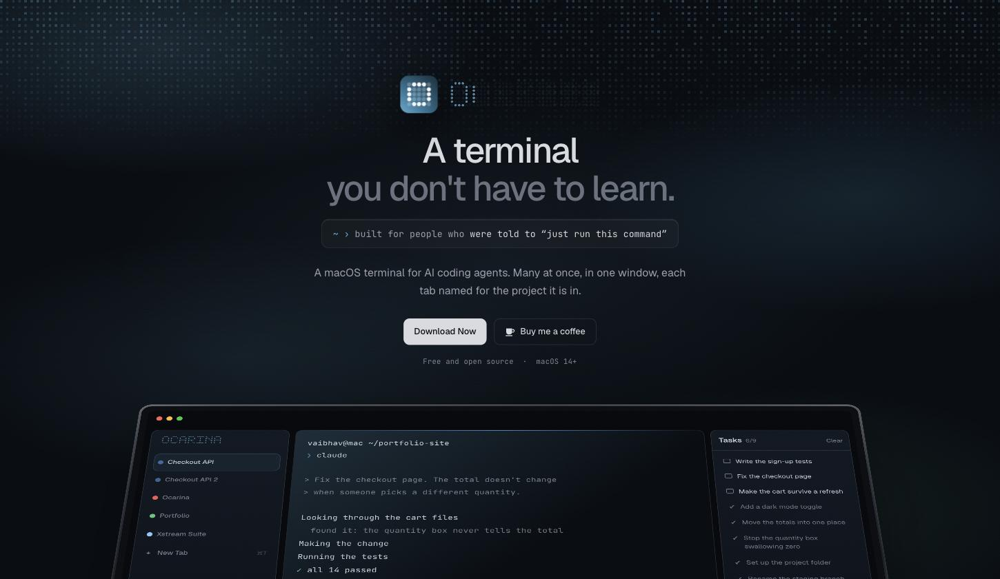
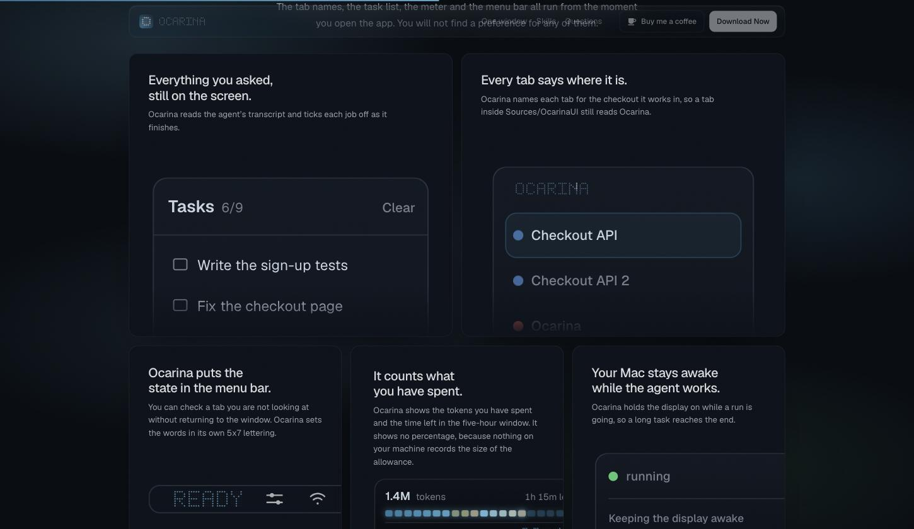

# ocarina-site

The landing page for [Ocarina](https://github.com/VaibhavVishal07/Ocarina-Terminal),
a macOS terminal you do not have to learn.

One static file. No build step, no dependencies, and no images on the page.
Open `index.html` in a browser and that is the site.



## The interface is drawn, not photographed

Every window and card on the page is HTML and CSS. The page loads no
screenshots. A screenshot goes stale the day the app changes and carries a
tenth of the app's resolution; markup stays sharp at any size and costs a
fraction of a PNG.

The dot-matrix lettering is painted to a canvas cell by cell, out of the same
5x7 alphabet the app draws its wordmark, its menu bar item and its empty board
in. `cells()` builds the model and `paint()` draws it, so the page and
`DotMatrix.swift` set the same words in the same hand.

## What the tiles hold



Six tiles, and each one holds a real card out of the window in the fold. The
page clones `.card.up.tabs`, `.card.up.panel` and `.card.down.tokencard` along
with the column each one lives in, because the rules that dress these cards are
written for where they sit inside that window. `.side .tabs` carries the tab
card's padding and row gap. A card cloned on its own loses nine such rules.

Their measurements come off the Swift, not off a guess:

| | Source |
|---|---|
| Row height 40, corner 10, spacing 7 | `TabSidebarView` |
| Tab name at 12pt medium | `TabSidebarView` |
| Status dot at 9 by 9 | `StatusDot` |
| Panel width 230, text inset 12, rows 2 apart | `TaskPanelView` |
| 20 quarter-hour cells, 7 tall, 2.2 apart | `UsageCardView.WindowBar` |
| Board words READY, WORKING, DONE | `ActivityStatusItem` |

Two cards have no counterpart in the app and the page draws them itself. Keep
Awake has no panel because the app leaves it on, and the skills tile shows
the shelf's head and its field with the rows cut off the right edge.

## Nineteen themes

The picker under the fold repaints the whole page. Every colour resolves
through custom properties on `:root`, so one press turns the ground, the type,
the glow, the grid and every drawn window at once. The colours come out of the
app's own theme JSON, including the board's four lamps: `lit`, `litDim`,
`unlit` and `highlight`. The meter ramps across three of them, cold at the top
of the window and warm at the end of it, which for Ocarina means `#31789B`
through `#64B2D8` to `#FFB838`.

The app icon holds its own two blues and ignores the theme. Everything else on
the page is a surface the app paints, so it follows; the icon is artwork on
disk that no theme touches.

## Changing the layout

The bento is twelve columns. One block near the top of the stylesheet sets
every tile's width, position and height:

```css
.tile[data-tile="tasks"]  { --span:6; --order:1; --h:430px; --zoom:0.95; --oy:32px; }
```

`--span` is columns out of twelve, `--order` is position, `--h` is the minimum
height. `--zoom`, `--ox` and `--oy` move and resize the card inside the tile.
The script works out a fit so each card fills its tile, and `--zoom` multiplies
that fit, so both survive a window resize.

Add `?layout` to the URL for a panel that changes all six live and hands back
the CSS block. The panel loads only with that flag.

## Running it

```
python3 -m http.server 8000
```

Then open `localhost:8000`. GitHub Pages serves `main`, so a push publishes.

## Writing

The copy goes through [stop-slop](https://github.com/hardikpandya/stop-slop):
no binary contrasts, no passive sentences missing their actor, no em dashes,
no adverbs. Ocarina does the verbs.
